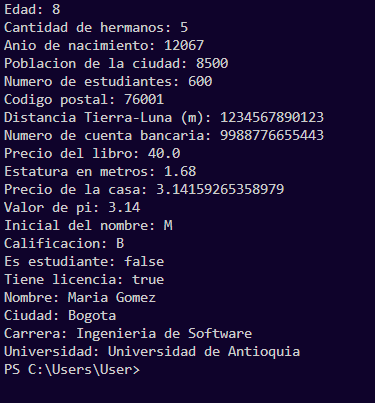
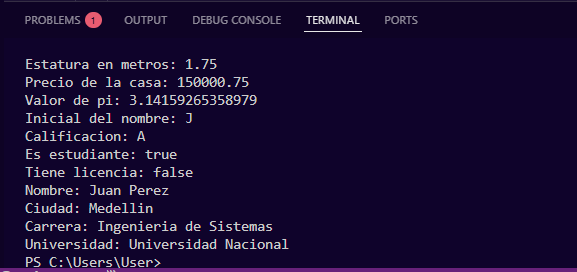
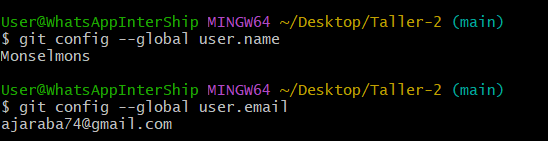

# Taller 2 - Variables y Condicionales

Proyecto desarrollado en Java que trabaja el manejo de variables de distintos tipos de datos primitivos, su inicialización, reasignación de valores, y la construcción de un programa con menú interactivo que utiliza estructuras condicionales y lectura de datos por consola con `Scanner` para resolver ecuaciones matemáticas.

## Participantes
- Esteban González Posada - [@estebangp2018-rgb](https://github.com/estebangp2018-rgb)
- Luis Monsalve - [@Monselmons](https://github.com/Monselmons)
- José Estrada - [@joseeg122](https://github.com/joseeg122)

## Características

- Declaración de 20 variables de diferentes tipos de datos primitivos en Java.
- Inicialización de variables con datos compatibles según su tipo.
- Reasignación de valores: algunas variables toman el valor de otras variables ya existentes, y otras se reasignan con datos nuevos escritos directamente en el código (hardcoded).
- Uso de literales especiales `f` (float), `L` (long) y comillas simples `''` (char).
- Programa de menú interactivo con 3 opciones que permite al usuario resolver una de dos ecuaciones ingresando los valores de `x` y `z`.
- Uso de estructuras condicionales (`if`, `else if`, `switch`) para controlar el flujo del programa.
- Lectura de datos ingresados por el usuario mediante la clase `Scanner`.
- Validación de división entre cero en ambas ecuaciones, mostrando un mensaje de error en vez de un resultado sin sentido (`Infinity`).

## Archivos del proyecto

- `Variables.java` — declaración e inicialización de las 20 variables.
- `Variables2.java` — versión con los valores reasignados (5 variables tomando el valor de otras, y el resto con datos nuevos hardcoded), tal como lo pide el punto 6 del taller.
- `Ecuaciones.java` — programa con menú interactivo para resolver las dos ecuaciones.

## Ejemplo de ejecución

### Consola - Programa de variables (Variables.java)



### Consola - Programa de variables reasignadas (Variables2.java)



### Consola - Programa de ecuaciones (Ecuaciones.java)

<!-- TODO: agregar aqui la captura real de Ecuaciones.java corriendo -->
<!--  -->

📎 También puedes ver el documento completo con todas las capturas del funcionamiento de `Ecuaciones.java` aquí: [Capturas del funcionamiento del archivo](capturas/Capturas%20del%20funcionamiento%20del%20archivo.docx)

## Manejo de errores (división entre cero)

El programa valida los valores ingresados por el usuario para evitar divisiones entre cero. A continuación, capturas de los mensajes de error funcionando correctamente:

<!-- TODO: agregar aqui las capturas de los errores, por ejemplo: -->
<!--  -->
<!--  -->

## Configuración de nombre y correo en los commits

Como parte del taller, se investigó y aplicó cómo cambiar el nombre y correo asociados a los commits de Git:




## Presentación

[Ver presentación](enlace-aqui)

---

## Tecnologías utilizadas

- Java
- Scanner (`java.util.Scanner`)
- Git y GitHub para control de versiones

---

## Requisitos

- Java JDK 8 o superior.
- Un IDE como Visual Studio Code con extensión para Java

## Ejecución

### 1. Compilar y ejecutar el programa de variables

```bash
javac Variables.java
java Variables
```

### 2. Compilar y ejecutar el programa de variables reasignadas

```bash
javac Variables2.java
java Variables2
```

### 3. Compilar y ejecutar el programa de ecuaciones

```bash
javac Ecuaciones.java
java Ecuaciones
```

---

## Recursos utilizados

- [Introducción a Java](https://www.youtube.com/watch?v=Ztr7_sNmSQI)
- [¿Qué es un algoritmo?](https://www.youtube.com/watch?v=9ko3JV9pjbs)
- [Condicionales](https://www.youtube.com/watch?v=6lk0cRlqnTU)
- [Condicionales anidados](https://www.youtube.com/watch?v=ZbuI6P1yLc8)
- [Lectura de datos I/O](https://www.youtube.com/watch?v=4jLxHxZGRas)
